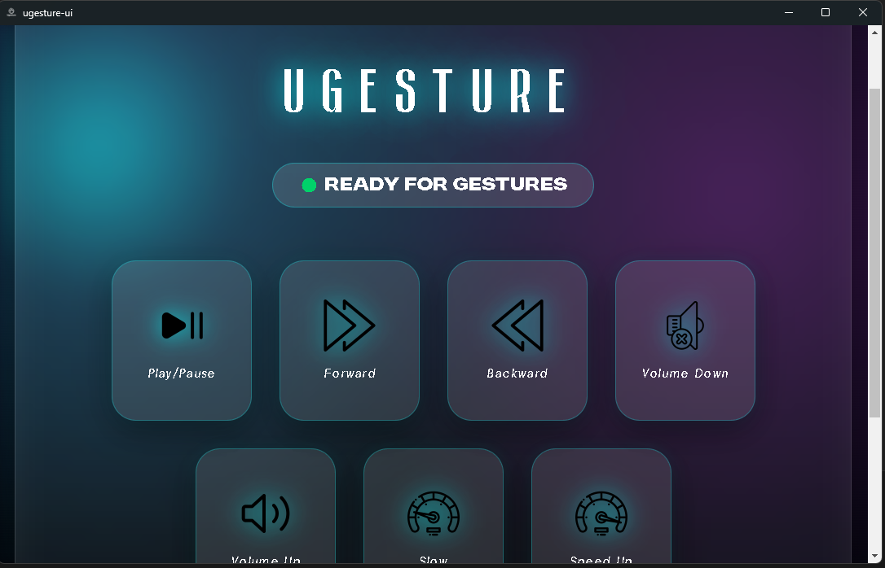
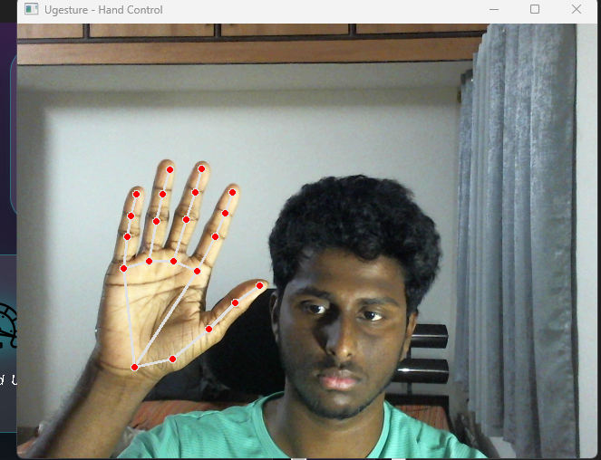
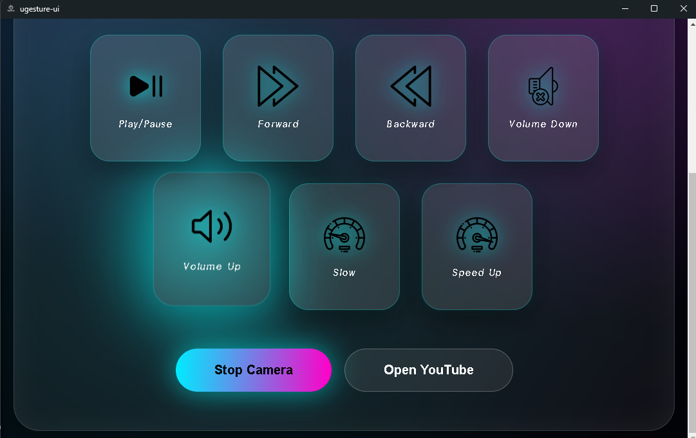

# ✋ UGesture  
### 🎮 Gesture-Controlled YouTube Player — Desktop Application

<p align="center">


</p>

---

## 🚀 Overview

**UGesture** is a modern **gesture-controlled desktop application** that allows users to control **YouTube playback using hand gestures** detected through a webcam.

It combines:

- 🐍 **Python** → Gesture engine (MediaPipe + OpenCV + Selenium)  
- ⚡ **Electron** → Desktop UI and system integration  
- 🎨 **Glassmorphism Gaming-Style UI** → Smooth modern interface  

Users can:

✔ Play / Pause videos  
✔ Seek forward / backward  
✔ Control volume  
✔ Adjust playback speed  
✔ Operate hands-free  

---

## 📸 Screenshots

### 🖥 Interface
<p align="center">

</p>

### ✋ Camera Detection
<p align="center">

</p>

### ✨ Spotlight & Hover Effects
<p align="center">

</p>

---

## 🖐 Supported Gestures

| Gesture | Action |
|--------|--------|
| 🤏 Pinch fingers | Play / Pause |
| 👉 Wave Right | Forward 5 seconds |
| 👈 Wave Left | Backward 5 seconds |
| ✌ Two fingers up | Volume Up / Mute toggle |
| ☝ One finger up | Volume Down / Unmute toggle |
| 🖐 Hand movement | Playback speed control |

---

## ✨ Features

- 🧠 Real-time **hand detection** using MediaPipe  
- 🎮 Fully **hands-free YouTube control**  
- ⚡ Smooth **Electron desktop app**  
- 🎨 Glassmorphism **gaming-style UI**  
- 💡 Cursor spotlight + hover animations  
- 📡 Real-time gesture status feedback  
- 🎥 Auto camera start from app  
- 🌐 Chrome debugging integration  

---

## 🏗 Architecture

Electron UI → Preload Bridge → Python Gesture Engine → Selenium Chrome Control

---

## 📂 Project Structure

ugesture/
│
├── gestures/ # Python gesture engine
│ ├── controller.py
│ ├── detector.py
│ ├── recognizer.py
│ ├── actions.py
│ └── utils.py
│
├── electron/ # Electron desktop UI
│ ├── main.js
│ ├── preload.js
│ ├── intro.html
│ ├── splash.html
│ ├── dashboard.html
│ └── dashboard.css
│
├── assets/
│ ├── icons/
│ ├── fonts/
│ ├── screenshots/
│ │ ├── interface.png
│ │ ├── camera_detection.png
│ │ └── spot_and_hover.png
│ └── intro.mp4
│
├── app.py
└── README.md

---

## 🧰 Requirements

### 🐍 Python (Recommended **3.11**)

Install dependencies:

```bash
pip install mediapipe opencv-python selenium numpy protobuf
```


### ⚡ Electron

Inside /electron folder:
npm install

---

### Running Constraints

▶️ Running The App
1️⃣ Start Chrome in Debug Mode

"C:\Program Files\Google\Chrome\Application\chrome.exe" --remote-debugging-port=9222 --user-data-dir="C:\chrome-debug"
Open YouTube in that Chrome window.

---

2️⃣ Start Desktop App

cd electron
npm start

3️⃣ Use

    Click Start Camera
    Click Open YouTube
    Control video using gestures

---

### 📦 Build Windows Installer

    cd electron
    npm run build

Installer appears in:

    electron/dist/

    ---

### 🛠 Troubleshooting

    🎥 Camera not opening

        Ensure webcam permissions enabled
        Close apps using camera
        Try different camera index in controller.py

    🌐 Chrome not detected

        Chrome must be launched with debugging port 9222
        Ensure YouTube opened in that window

    🖐 Gesture lag

        Use good lighting
        Keep hand centered
        Avoid cluttered backgrounds

---

### 🔮 Future Improvements

    Embed camera feed inside Electron UI
    Multi-tab YouTube control
    Custom gesture training
    Theme switching system
    Background tray mode
    Cross-platform installers

---

### 👨‍💻 Author

    V. Chandanadhithyan
    GitHub: https://github.com/adhi-debug 
    If you like this project:
    ⭐ Star the repository

---

### 📄 License

    MIT License © 2026 V Adhithyan

        Permission is hereby granted, free of charge, to any person obtaining a copy
    of this software and associated documentation files to deal in the Software
    without restriction, including without limitation the rights to use, copy,
    modify, merge, publish, distribute, sublicense, and/or sell copies.

---

<p align="center"> <b>Built with Python + Electron + Passion 🚀</b> </p> ```


